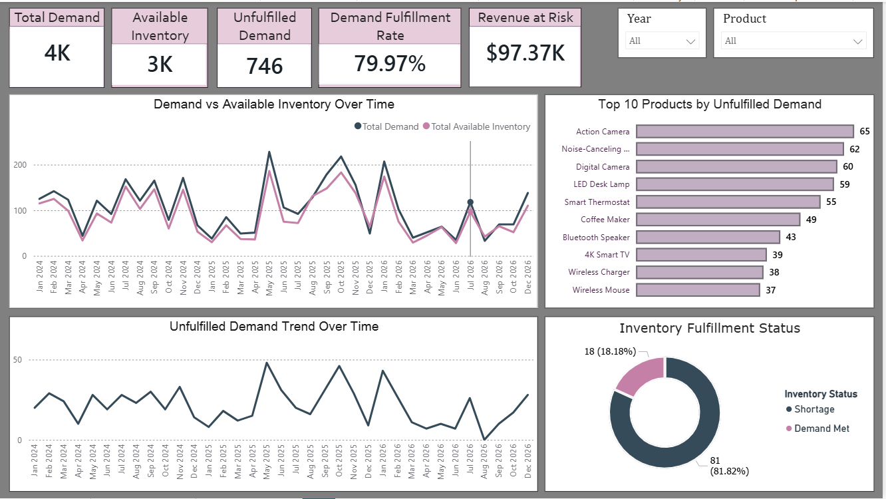
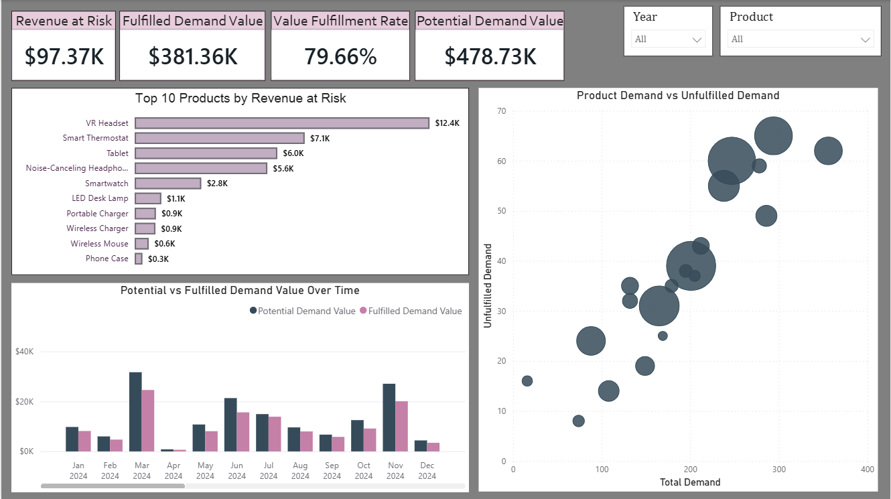
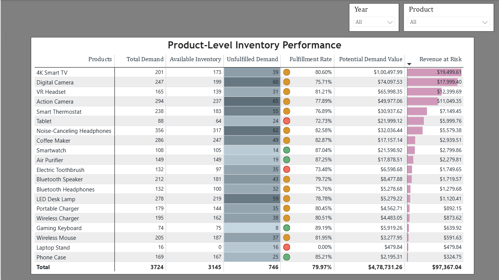
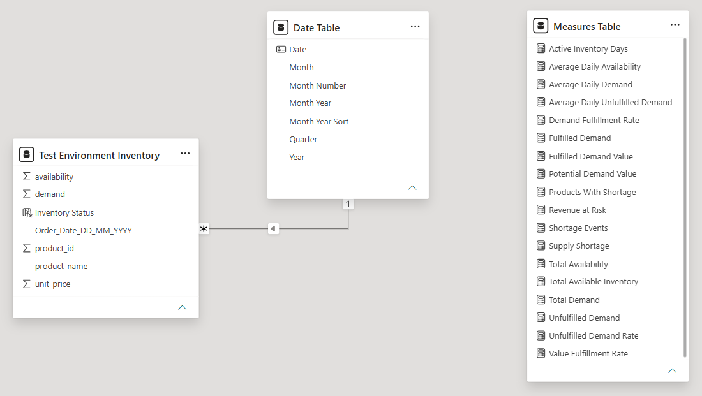

# Inventory Demand & Supply Analysis

### Power BI | SQL Server | MySQL | DAX | Data Modeling

An end-to-end inventory analytics project built to analyze product demand, inventory availability, fulfillment performance, and the financial impact of inventory shortages.
The project covers the complete analytics workflow—from SQL-based data validation and production data-quality remediation to a SQL Server → MySQL database migration and an interactive three-page Power BI dashboard.

---

## Dashboard Preview

### 1. Inventory Overview



Provides an executive overview of demand and inventory performance.

Key metrics:
- Total Demand: 3,724 units
- Available Inventory: 3,145 units
- Unfulfilled Demand: 746 units
- Demand Fulfillment Rate: 79.97%
- Revenue at Risk: $97.37K

The page also analyzes:
- Demand vs available inventory over time
- Top 10 products by unfulfilled demand
- Unfulfilled demand trends
- Inventory fulfillment status

---

### 2. Financial Impact



Analyzes the monetary impact of inventory shortages.

Key metrics:
- Potential Demand Value: $478.73K
- Fulfilled Demand Value: $381.36K
- Revenue at Risk: $97.37K
- Value Fulfillment Rate: 79.66%

The page identifies:
- Products generating the greatest revenue exposure
- Potential vs fulfilled demand value over time
- Products combining high demand, high shortages, and high financial exposure

---

### 3. Product Analysis



Provides detailed product-level inventory performance.

The matrix includes:
- Total Demand
- Available Inventory
- Unfulfilled Demand
- Fulfillment Rate
- Potential Demand Value
- Revenue at Risk

Conditional formatting is used to highlight shortages, fulfillment performance, and financial exposure.

---

## Business Problem

The objective was to determine whether available inventory was sufficient to satisfy customer demand and quantify the impact of inventory shortages.

For each product:

Availability >= Demand → Demand Met
Demand > Availability → Inventory Shortage

The analysis answers questions such as:

- Which products experience the highest shortages?
- What percentage of demand is successfully fulfilled?
- Which products create the greatest revenue exposure?
- How do demand and inventory change over time?
- Which products should receive greater replenishment attention?

---

## Data

Two primary datasets were used.

### Inventory Data

| Column | Description |
|---|---|
| Order Date | Date associated with the inventory record |
| Product ID | Product identifier |
| Availability | Units available |
| Demand | Units demanded |

### Products

| Column | Description |
|---|---|
| Product ID | Unique product identifier |
| Product Name | Product name |
| Unit Price ($) | Selling price per unit |

The inventory and product datasets were combined using Product ID to create a reporting-ready dataset containing:

Order Date | Product ID | Availability | Demand | Product Name | Unit Price

---

## Data Quality Scenario

During production data validation, Product IDs `21` and `22` were found in the production inventory data even though the product master contained only the valid product set.
This represented a referential data-quality issue between the transactional inventory data and product master.
In the simulated business scenario, the discrepancy was escalated and the correct mappings were confirmed as:

21 → 7  
22 → 11

The production data was corrected only after the mappings were confirmed, and the Product IDs were subsequently revalidated.

This demonstrates the workflow:

Detect → Investigate → Escalate → Confirm → Correct → Validate

---

## SQL Workflow

SQL Server was initially used for the test and production environments.

The SQL workflow included:

- Creating test and production databases
- Inspecting source tables
- Validating Product IDs and dates
- Checking missing values
- Joining inventory and product data
- Detecting invalid Product IDs
- Updating confirmed Product ID mappings
- Revalidating production data
- Creating a reporting-ready table

Example:

```sql
SELECT
    a.[Order_Date_DD_MM_YYYY],
    a.product_id,
    a.availability,
    a.demand,
    b.product_name,
    b.unit_price
FROM [dbo].[Test Environment Inventory Dataset] AS a
LEFT JOIN [dbo].[Products] AS b
    ON a.product_id = b.product_id;
```

---

## SQL Server → MySQL Migration

The project also simulates a database migration where the reporting source was changed from **Microsoft SQL Server to MySQL**.

The migration workflow included:

1. Recreating the production environment in MySQL
2. Loading the production datasets
3. Reapplying validated data-quality corrections
4. Recreating the inventory and product transformation logic
5. Creating a reporting-ready table in MySQL
6. Changing the Power BI data source from SQL Server to MySQL
7. Verifying that the existing reporting logic continued to function correctly

The SQL Server and MySQL scripts used for data validation, transformation, data-quality correction, and migration are available in the [`sql/`](sql/) folder.

---

## Data Model

The Power BI data model consists of:

- **Inventory Reporting** — main reporting/fact table containing demand, availability, product, and pricing information.
- **Date Table** — dedicated calendar table used for time-based analysis and filtering.
- **Measures Table** — centralized table used to organize DAX measures.

The `Date Table` has a **one-to-many (1:*) relationship** with the inventory table:

`Date Table[Date]` → `Inventory Reporting[Order_Date_DD_MM_YYYY]`

A calculated column, `Inventory Status`, classifies each inventory record into:

- **Demand Met** — when available inventory is greater than or equal to demand.
- **Shortage** — when demand exceeds available inventory.


---

## Key DAX Measures

The dashboard uses DAX measures to evaluate inventory performance, demand fulfillment, and financial impact.

Key measures include:

- **Total Demand**
- **Total Available Inventory**
- **Fulfilled Demand**
- **Unfulfilled Demand**
- **Demand Fulfillment Rate**
- **Potential Demand Value**
- **Fulfilled Demand Value**
- **Revenue at Risk**
- **Value Fulfillment Rate**
- **Average Daily Demand**
- **Average Daily Availability**
- **Average Daily Unfulfilled Demand**

### Example: Unfulfilled Demand

```DAX
Unfulfilled Demand =
SUMX(
    'Inventory Reporting',
    MAX(
        'Test Environment Inventory'[demand]
            - 'Test Environment Inventory'[availability],
        0
    )
)
```

This measure calculates the number of units that could not be fulfilled when product demand exceeded available inventory. Using `MAX(..., 0)` prevents excess inventory from producing negative shortage values.

For complete DAX calculations and explanations, see [`documentation/DAX_Measures.md`](documentation/DAX_Measures.md).

---

## Key Insights

- Total demand reached **3,724 units**, compared with **3,145 units of recorded inventory availability**.
- **746 units of demand remained unfulfilled**, resulting in an overall **Demand Fulfillment Rate of 79.97%**.
- The total potential demand value was approximately **$478.73K**, of which **$381.36K** was fulfilled.
- Inventory shortages represented approximately **$97.37K in Revenue at Risk**, highlighting the financial impact of insufficient inventory.
- **81 out of 99 inventory records (81.82%)** experienced some level of shortage, indicating that shortages occurred frequently across the analyzed records.
- Products with the highest **unfulfilled demand were not always the products with the highest Revenue at Risk**, showing that product price significantly affects the financial impact of inventory shortages.
- The analysis demonstrates that inventory prioritization should consider both **shortage quantity and financial exposure**, rather than focusing only on the number of unavailable units.

---

## Business Recommendations

- Prioritize inventory replenishment for products with a combination of **high demand, high unfulfilled demand, and high Revenue at Risk**.

- Give additional attention to **high-value products**, as even relatively small inventory shortages can create significant financial exposure.

- Investigate periods with recurring shortage spikes to identify potential causes such as **demand fluctuations, replenishment delays, supplier constraints, or inventory-planning issues**.

- Use both **Unfulfilled Demand** and **Revenue at Risk** when prioritizing products, since products with the highest shortage quantities may not always have the greatest financial impact.

- Regularly monitor **Demand Fulfillment Rate** and **Value Fulfillment Rate** to evaluate whether inventory availability is improving relative to customer demand.

---

## Tools & Technologies

| Tool | Usage |
|---|---|
| **Power BI** | Data modeling, DAX, KPI development, dashboard creation and visualization |
| **SQL Server** | Test/production environments, data validation, transformation and data-quality checks |
| **MySQL** | Database migration, production data processing and reporting-table creation |
| **Power Query** | Data preparation and source integration |
| **DAX** | Business metrics, fulfillment KPIs and financial-impact calculations |

---

## Repository Structure

```text
Inventory-Demand-Supply-Analysis/
│
├── README.md
│
├── dashboard/
│   └── Inventory_Demand_Supply_Analysis.pbix
│
├── data/
│   ├── Products.csv
│   ├── Test_Environment_Inventory.csv
│   └── Production_Environment_Inventory.csv
│
├── sql/
│   ├── 01_sql_server_test_environment.sql
│   ├── 02_sql_server_production.sql
│   └── 03_mysql_migration.sql
│
├── documentation/
│   ├── DAX_Measures.md
│   └── Data_Dictionary.md
│
└── screenshots/
    ├── 01_inventory_overview.png
    ├── 02_financial_impact.png
    ├── 03_product_analysis.png
    └── 04_data_model.png
```

---

## Project Summary

This project demonstrates an end-to-end inventory analytics workflow covering **data validation, SQL transformation, data-quality remediation, SQL Server-to-MySQL migration, Power BI data modeling, DAX calculations, dashboard development, and business analysis**.

The final solution enables users to monitor inventory fulfillment, identify shortage-prone products, evaluate demand and availability trends, quantify potential revenue exposure, and prioritize inventory decisions using both **operational and financial metrics**.
